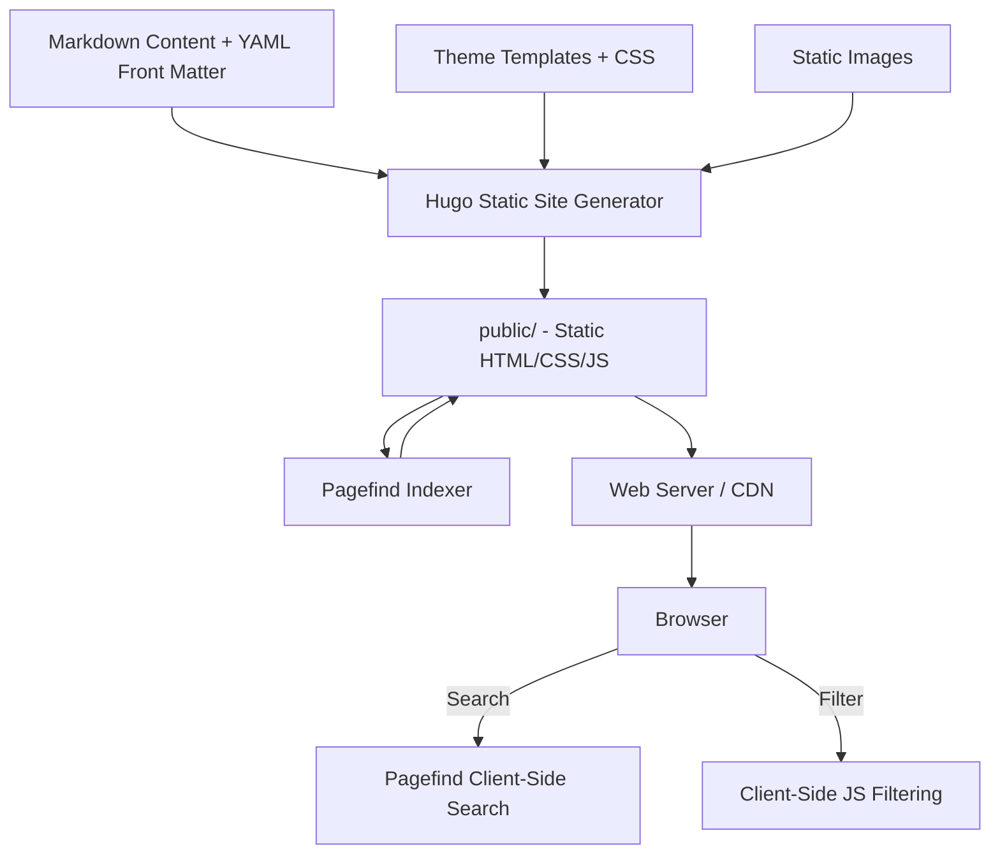

# AGENTS.md

> For feature specifications, business rules, and domain models, see [SPEC.md](./SPEC.md).

---

## Table of Contents

- [Project Overview](#project-overview)
- [Tech Stack](#tech-stack)
  - [Package Management](#package-management)
  - [Static Site Generator](#static-site-generator)
  - [Frontend](#frontend)
  - [Search](#search)
  - [Scraper Tooling](#scraper-tooling)
- [Project Initialization](#project-initialization)
- [Project Structure](#project-structure)
- [Architecture](#architecture)
  - [System Architecture Diagram](#system-architecture-diagram)
  - [Content Model](#content-model)
- [Development Workflow](#development-workflow)
  - [Version Control](#version-control)
  - [Building & Serving](#building--serving)
  - [Adding Content](#adding-content)
  - [Re-scraping Content](#re-scraping-content)
- [Best Practices & Key Conventions](#best-practices--key-conventions)
- [Notes for AI Agents](#notes-for-ai-agents)

---

## Project Overview

World History Commons (WHC) is a digital resource for teachers, students, and anyone interested in exploring global history. It provides primary source documents, teaching modules, methodological approaches, and website reviews spanning world history.

Originally built on Drupal 10, this project is a full migration to Hugo (a static site generator) for improved performance, simpler maintenance, and lower hosting costs. The site serves approximately 2,500 content pages with images, videos, and structured metadata.

The project is maintained by the Roy Rosenzweig Center for History and New Media (RRCHNM) at George Mason University, in collaboration with the World History Association. Funded by the NEH and ACLS.

---

## Tech Stack

### Package Management

- **Hugo**: Installed via Homebrew (`brew install hugo`). Version 0.128.0+ required.
- **uv**: Python package manager for the scraper tooling. Used instead of pip.
- **npx**: Used to run Pagefind for search indexing.
- **just**: Task runner for common commands. Justfile in project root.

### Static Site Generator

- **Hugo** v0.128.0+ (extended edition)
- Theme: `themes/whc/` — custom theme ported from the Drupal 10 WHC theme
- Markdown content with YAML front matter
- Taxonomy system for regions, subjects, and time periods
- Hugo's built-in pagination for listing pages

### Frontend

- **No build step** — plain CSS and vanilla JavaScript
- CSS: Ported directly from the Drupal theme (DIN font family, `#4f90b8` blue, `#fdbd06` gold)
- JS: Minimal client-side code for:
  - Listing page filters (region, time period, subject, type)
  - Homepage gallery randomization
  - Citation access date generation
- **Font Awesome 5.15.2** via CDN
- **Pagefind UI** for search interface

### Search

- **Pagefind** v1.5.0+ — static search indexing
- Index built post-Hugo-build: `npx pagefind --site public`
- Search UI rendered on `/search/` page
- Header search box submits to `/search/?q=term`

### Scraper Tooling

- **Python 3.12+** with uv for package management
- Located in `scraper/` directory
- Dependencies: beautifulsoup4, requests, markdownify
- Purpose: one-time migration from Drupal 10, plus verification tools

---

## Project Initialization

### Prerequisites

- Hugo v0.128.0+ extended (`brew install hugo`)
- Node.js (for npx/Pagefind)
- uv (`brew install uv`) — only needed if re-running scrapers
- just (`brew install just`) — optional but recommended

### Setup

```bash
git clone <repo-url>
cd whc

# Build the site and search index
just build

# Or manually:
hugo
npx pagefind --site public

# Start dev server
just serve
# Or: hugo server -D
```

The site will be available at `http://localhost:1313/`.

No environment variables, database, or API keys are needed — it's a fully static site.

---

## Project Structure

```
whc/
├── content/                # All site content (markdown + YAML front matter)
│   ├── sources/            # Primary source documents (~1,960 files)
│   ├── teaching/           # Teaching modules (~149 files)
│   ├── methods/            # Methodological approaches (~48 files)
│   ├── reviews/            # Website reviews (~335 files)
│   ├── pages/              # Standalone pages (about, team, guides, etc.)
│   └── search/             # Search results page
├── themes/whc/             # Hugo theme
│   ├── layouts/            # HTML templates
│   │   ├── _default/       # Base layout, home, list, single, search, taxonomy
│   │   ├── sources/        # Sources-specific list (Type filter) and single
│   │   ├── teaching/       # Teaching single (collapsible sections)
│   │   ├── methods/        # Methods single (collapsible sections)
│   │   ├── reviews/        # Reviews single (sidebar layout)
│   │   └── partials/       # Header, footer, citation, tags, first-sentence
│   └── static/             # Theme static assets
│       ├── css/            # base.css (Drupal core), whc.css (theme)
│       ├── fonts/          # DIN-Regular.ttf, DIN-Bold.ttf
│       └── img/            # Logos, icons, arrows
├── static/
│   └── images/             # Scraped content images (~3,570 files)
├── scraper/                # Python scraper tooling (uv project)
│   ├── scrape.py           # Main scraper (all 4 content sections)
│   ├── scrape_pages.py     # Standalone pages
│   ├── scrape_source_types.py  # Source type metadata
│   ├── scrape_thumbnails.py    # Listing thumbnails
│   ├── scrape_slideshow_images.py  # Teaching/methods slideshow images
│   ├── scrape_related_sources.py   # Related source tile data
│   ├── scrape_videos.py           # YouTube embed IDs
│   ├── scrape_source_text.py      # Primary source transcription text
│   ├── verify_urls.py             # URL comparison tool
│   ├── fix_yaml.py, fix_yaml2.py  # YAML escaping fixes
│   └── pyproject.toml             # uv project config
├── hugo.toml               # Hugo site configuration
├── justfile                # Task runner commands
└── .gitignore
```

---

## Architecture

### System Architecture Diagram



The site is fully static. Hugo generates HTML at build time. Pagefind builds a search index from the generated HTML. All interactivity (search, filtering, gallery randomization, citation dates) is client-side JavaScript.

### Content Model

**Sources** (`content/sources/`):
- Front matter: title, doc_type, drupal_node_id, source_type, url, image, youtube_id, regions, subjects, time_periods, source_citation, credits, how_to_cite
- Body: annotation text, optional `## Text` section with primary source transcription

**Teaching** (`content/teaching/`):
- Front matter: title, doc_type, drupal_node_id, url, image, authors, regions, subjects, time_periods, related_sources (list of link/image/alt), how_to_cite
- Body: structured with `## Overview`, `## Essay`, `## Primary Sources` (with `### ` sub-entries), `## Document Based Question`, `## Credits`, etc.

**Methods** (`content/methods/`):
- Same structure as Teaching

**Reviews** (`content/reviews/`):
- Front matter: title, doc_type, drupal_node_id, url, image, website_authors, reviewer, reviewed_url, pull_quote, how_to_cite, regions, subjects, time_periods
- Body: review text

**Pages** (`content/pages/`):
- Front matter: title, url
- Body: page content

---

## Development Workflow

### Version Control

- **Branching**: GitHub Flow (feature branches off main)
- **Commit messages**: Conventional Commits (`feat:`, `fix:`, `chore:`, `docs:`, `content:`)
- **Content commits**: Use `content:` prefix for adding/editing content pages

### Building & Serving

```bash
# Full build (Hugo + Pagefind)
just build

# Dev server with live reload
just serve

# Build + index + serve
just dev
```

Hugo build output goes to `public/`. This directory is gitignored.

### Adding Content

1. Create a new `.md` file in the appropriate `content/` subdirectory
2. Include required front matter fields (see Content Model above)
3. For new content, include a `date:` field for sort ordering (new content sorts before legacy Drupal content)
4. Do NOT use `type` as a front matter key — it's reserved by Hugo. Use `doc_type` instead.
5. Run `just build` to verify

### Re-scraping Content

The scraper tooling is for the initial migration and verification. To re-run:

```bash
just scrape           # Full scrape (~1 hour)
just scrape-pages     # Standalone pages only
just scrape-types     # Source type metadata
just scrape-thumbnails # Teaching/methods/reviews thumbnails
just fix-yaml         # Fix YAML escaping issues
just verify-urls      # Compare URLs against live Drupal site
```

---

## Best Practices & Key Conventions

**Front Matter:**
- Use YAML block scalars (`|`) for multiline string values
- Use `doc_type` not `type` for content type metadata
- Always include `url:` to preserve original Drupal paths
- Quote strings containing special YAML characters

**Templates:**
- Section-specific layouts go in `themes/whc/layouts/{section}/`
- Shared components go in `themes/whc/layouts/partials/`
- Use `markdownify` for rendering markdown strings from front matter
- Use `safeJS` + `jsonify` when embedding data in script tags

**CSS:**
- All styles are in `themes/whc/static/css/whc.css` (minified, ported from Drupal)
- New styles should be appended to the end of the file
- Key colors: `#4f90b8` (blue), `#fdbd06` (gold), `#1b1b1b` (text), `#edf4f7` (light blue bg)
- Key font: `DIN` / `DIN-Bold`

**URLs:**
- All content preserves its original Drupal URL path for link stability
- Section listing URLs match Drupal: `/primary-sources/`, `/teaching/`, `/method/`, `/website-reviews/`
- Hugo sections use different directory names: `sources/`, `teaching/`, `methods/`, `reviews/`
- The `url:` front matter field handles the mapping

---

## Notes for AI Agents

**Key Gotchas:**
- `type` is a reserved Hugo front matter field — always use `doc_type` for content type metadata
- The CSS is minified in a single file — search carefully when modifying styles
- Template `split` on `"## "` will also match `"### "` — use `"\n## "` to split only on h2 headings
- Hugo's `jsonify` produces valid JSON strings including quotes — don't double-wrap in quotes
- Listing pages use a hybrid approach: Hugo-rendered HTML by default, JS takes over only when filters are applied

**When Making Changes:**
- Run `just build` (not just `hugo`) to also rebuild the Pagefind search index
- Test listing pages both with and without filters applied
- Check mobile responsiveness — the CSS has responsive breakpoints at 800px and 600px
- Verify URLs haven't changed — link stability is critical for educators' lesson plans

**Content Structure:**
- Teaching/methods markdown uses `## ` headings to delineate collapsible sections
- The sources template splits content on `"\n## Text\n"` to separate annotation from transcription
- Primary source entries within teaching/methods use `### ` headings with linked titles

**What to Avoid:**
- Don't add Hugo front matter fields named `type`, `layout`, `slug`, or `weight` for custom data
- Don't modify the CSS asset paths — they've been rewritten from Drupal's `/themes/whc/` to Hugo's flat `/` structure
- Don't embed large amounts of data in templates without `safeJS` — Hugo will escape it
- Don't use `pip` — use `uv` for Python package management

---

*Last Updated: 2026-04-13*
*This document is maintained for AI agent context and onboarding.*
