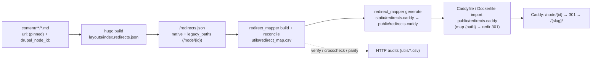

# Legacy URL Redirects (Drupal `/node/{id}` → Hugo → Caddy)

How worldhistorycommons.org's old Drupal `/node/{id}` URLs keep working after the Hugo
migration, and how to keep redirects correct if the Hugo URLs ever change.

- **Old site:** worldhistorycommons.org (Drupal)
- **New site:** this Hugo repo, fronted by Caddy

## 0. Why this exists (the whc-specific situation)

Unlike a typical migration, whc **did not change its public URLs**. Every content file
pins `url:` in front matter to its original clean Drupal slug (e.g.
`/1879-cleveland-protestant-orphan-asylum-annual-reports`), so Hugo serves the exact same
paths Drupal did. `scraper/verify_urls.py` asserts that 1:1 parity. Those slug URLs need
**no** redirect — they didn't move.

The one form that was **not** preserved: Drupal also serves every node at `/node/{id}`
(it renders the node inline there, returning 200, with a `<link rel="canonical">` pointing
at the slug). The Hugo site has no `/node/` pages, so `/node/1219` would **404**. This
pipeline closes that gap: it maps every `/node/{drupal_node_id}` → the page's current slug
as a **301**, owned by Caddy.

> **We do not touch `url:` or any content front matter.** All 2,527 content files keep
> byte-identical URLs. Only `/node/{id}` redirects are added, derived from the
> `drupal_node_id` already present in front matter.

## 1. The core idea: redirects are *derived*, not hand-maintained

There is **no hand-edited redirect list**. Every old→new mapping is computed from each
page's own front matter (`drupal_node_id`, plus any `aliases:` — see §5), flowing through:



The `/node/{id}` target is derived from `.RelPermalink` at build time, so it **always tracks
the page's current URL** automatically.

## 2. Content model

- **`url:` stays pinned.** `.RelPermalink` therefore equals the current public URL — which
  is the redirect target. No content edits are made by this pipeline.
- **`drupal_node_id:` is the source of the `/node/{id}` legacy path.** Present on 2,492
  items; the ~29 hand-authored `content/pages/*` without one simply get no `/node/` redirect
  (correct — they never had a Drupal node).
- **`aliases:` is the seam for future URL changes** (empty today). See §5.
- **`disableAliases = true`** (in `hugo.toml`): Hugo writes no alias stub HTML; Caddy is the
  sole redirect authority. (This governs front-matter `aliases:`. Hugo's separate pagination
  `/page/1/` → listing stubs are unrelated and unaffected.)

## 3. The tools (`utils/`, run with `uv`)

| Component | Purpose |
|---|---|
| `layouts/index.redirects.json` | Hugo template that emits `/redirects.json` (the manifest) |
| `utils/redirect_mapper.py` | `build` · `reconcile` · `generate` · `verify` · `crosscheck` · `parity` · `crawl` |
| `static/redirects.caddy` | GENERATED Caddy `map` of legacy → native 301s (committed; Hugo copies it to `public/redirects.caddy`, so it ships in the release artifact) |
| `utils/redirect_map.csv` | GENERATED authoritative map, human-diffable (committed) |

## 4. Running the pipeline (runbook)

```bash
# 1. Build Hugo (emits public/redirects.json). `just build` also runs Pagefind.
just build

# 2. Generate the map + Caddy snippet  (= build → reconcile → generate)
just redirects

# 3. Serve + verify locally
caddy run --config Caddyfile        # serves ./public on :8080, imports public/redirects.caddy
just redirects-verify target=http://localhost:8080
```

`just redirects` is the one command to regenerate everything. `static/redirects.caddy` and
`utils/redirect_map.csv` are committed; re-run and commit whenever content or URLs change.

## 5. Preserving redirects when a Hugo URL changes (future-proofing)

Because redirects are derived from front matter, the workflow for a URL change is the
standard Hugo "this page moved" idiom:

1. Change the page's URL (edit its `url:` pin, or introduce a `[permalinks]` rule).
2. Add the **old** path to that page's `aliases:` list, e.g.:
   ```yaml
   url: /new-slug
   aliases:
     - /old-slug
   ```
3. Re-run `just build && just redirects`.

Result: `/old-slug` now 301s to `/new-slug`, **and** `/node/{id}` auto-updates to `/new-slug`
(it's derived from `.RelPermalink`). No hand-edited list to maintain; `redirects.caddy` is
fully regenerated. The manifest template already reads both `.Aliases` and `drupal_node_id`,
so this works the moment you add an alias.

## 6. Verification & auditing

Reports land in `utils/*.csv` (gitignored). All support `--resume` / `--limit`.

- **`verify --target <caddy>`** — for each redirect: `/node/{id}` returns **301** with
  `Location` = expected slug, and the slug returns **200**; flags loops.
  *Full run against the moby Docker image: 2,492/2,492 redirects → correct 301; 2,492/2,492
  targets → 200.*
- **`crosscheck --old-site https://worldhistorycommons.org`** — oracle against the live
  Drupal site. whc's Drupal serves `/node/{id}` at **200** (not a redirect), so the check
  compares that page's `<link rel="canonical">` to our recorded slug. *Sample of 150:
  150/150 agree via canonical.*
- **`parity --old-site <drupal> --target <caddy>`** — confirms each legacy URL resolves on
  the live old site **and** its target resolves on the new site.

## 7. Caddy integration

`redirects.caddy` is a **snippet** (a `map` + `redir`, not a full server), imported inside a
site block. `map` + `redir` run before `file_server`, so a legacy `/node/{id}` 301s instead
of 404ing; real slug URLs miss the map and are served directly.

It is generated into `static/redirects.caddy`, so Hugo publishes it to `public/redirects.caddy` —
this is what puts it in the build/release artifact. The container therefore imports it from
`/srv/redirects.caddy` (no separate `COPY`). One side effect: the snippet is now also fetchable
at `/redirects.caddy`. That's harmless (it's derived from public URLs); block it with a matcher
if you'd rather not serve it.

Generated snippet shape:

```caddy
map {path} {redirect_target} {
	default ""
	/node/1219  /1879-cleveland-protestant-orphan-asylum-annual-reports/
	/node/1219/ /1879-cleveland-protestant-orphan-asylum-annual-reports/
	# … both slash variants per node id …
}
@hasRedirect expression `{redirect_target} != ""`
redir @hasRedirect {redirect_target} 301
```

Two ways to serve it, both committed:

- **`Caddyfile`** (repo root, standalone) — `root * public`, `import public/redirects.caddy`.
  Local: `caddy run --config Caddyfile`. For production, set the real site address.
- **`Dockerfile`** (two-stage) — stage 1 runs `hugo` + `npx --no-install pagefind` (Pagefind
  pinned via `package.json`/`package-lock.json`); because `redirects.caddy` is generated into
  `static/`, Hugo emits it at `public/redirects.caddy`. Stage 2 (`stagex/user-caddy`) copies
  `public/` → `/srv` and imports `/srv/redirects.caddy` (no separate `COPY` needed). `static/images/`
  is bundled into the image on purpose (see `.dockerignore`). This is the image the CI/CD
  workflow (`.github/workflows/cicd.yml`) builds and deploys.

The generator handles: both slash variants (`/x` and `/x/`), dropped self-redirect loops,
and deterministic conflict resolution (matched > fallback, fewer segments, lexicographic).

## 8. Deployment & operations

- **Docker on moby (remote Docker over SSH):**
  ```bash
  export DOCKER_HOST=ssh://moby            # ~/.ssh/config Host moby -> 10.112.113.191
  just build && just redirects             # produce public/ (incl. redirects.caddy) first
  docker build -t worldhistorycommons:latest .
  docker run -d --name whc -p 8137:80 worldhistorycommons:latest
  uv run utils/redirect_mapper.py verify --target http://10.112.113.191:8137
  ```

### Committed vs generated

- **Committed:** content, `layouts/index.redirects.json`, `hugo.toml`, `utils/redirect_mapper.py`,
  `utils/redirect_map.csv`, `static/redirects.caddy`, `Caddyfile`, `Dockerfile`, `.dockerignore`, `justfile`.
- **Gitignored (regenerated on demand):** `public/` (incl. `redirects.json` and the copied `redirects.caddy`),
  `utils/redirect_verify.csv`, `utils/redirect_crosscheck.csv`, `utils/redirect_parity.csv`,
  `utils/old_urls.csv`.
