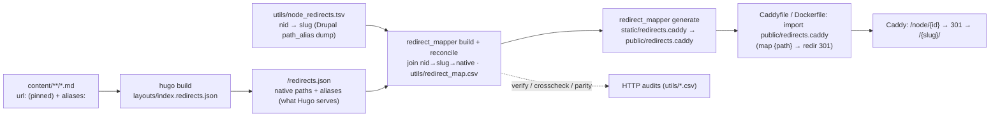

# Legacy URL Redirects (Drupal `/node/{id}` → Hugo → Caddy)

How worldhistorycommons.org's old Drupal `/node/{id}` URLs — **and its taxonomy facet
listings** (`/region`, `/subject`, `/time-period`) — keep working after the Hugo migration,
and how to keep redirects correct if the Hugo URLs ever change.

- **Old site:** worldhistorycommons.org (Drupal)
- **New site:** this Hugo repo, fronted by Caddy

## 0. Why this exists (the whc-specific situation)

Unlike a typical migration, whc **did not change its public URLs**. Every content file
pins `url:` in front matter to its original clean Drupal slug (e.g.
`/1879-cleveland-protestant-orphan-asylum-annual-reports`), so Hugo serves the exact same
paths Drupal did. `scraper/verify_urls.py` asserts that 1:1 parity. Those slug URLs need
**no** redirect — they didn't move.

The one form that was **not** preserved: Drupal also serves every node at `/node/{id}`
(it renders the node inline there, returning 200, with a `<link rel="canonical">` pointing
at the slug). The Hugo site has no `/node/` pages, so `/node/1219` would **404**. This
pipeline closes that gap: it maps every `/node/{drupal_node_id}` → the page's current slug
as a **301**, owned by Caddy.

> **We do not touch `url:` or any content front matter.** All 2,527 content files keep
> byte-identical URLs. Only `/node/{id}` redirects (from `drupal_node_id`) and taxonomy
> facet redirects (§9) are added; no content is modified.

There is a **second** unpreserved form: Drupal's taxonomy listing pages. Drupal browsed by
facet at **singular** paths — `/region/europe`, `/subject/culture`,
`/time-period/modern-1800-ce-1950-ce`. Hugo emits its taxonomies at **plural** paths with
different term slugs — `/regions/europe/`, `/subjects/culture/`,
`/time_periods/modern-1800-ce---1950-ce/` — so every old facet URL 404s. Because taxonomy
terms carry no `aliases:` front matter, these can't flow through the manifest; they are
handled by a small curated map. See **§9**.

## 1. The core idea: redirects are *derived*, not hand-maintained

There is **no hand-edited redirect list**. The `/node/{id}` old→new mappings are computed by
joining two data sources — Drupal's `path_alias` dump (nid → slug, `utils/node_redirects.tsv`)
against what Hugo actually serves (native paths, from the manifest). Node ids do **not** live
in content front matter. `aliases:` (future URL moves, §5) still flow through the manifest.



The `/node/{id}` target is resolved to the page's current native URL via the manifest at build
time, so it **always tracks the page's current URL** automatically. A nid whose slug Hugo
doesn't serve (unpublished/removed node) is **skipped**, not redirected to a 404.

## 2. Content model

- **`url:` stays pinned.** `.RelPermalink` therefore equals the current public URL — which
  is the redirect target. No content edits are made by this pipeline.
- **Node ids live in `utils/node_redirects.tsv`, not front matter.** That file is a dump of
  Drupal's `path_alias` table (nid → slug); the pipeline joins each nid to its current native
  URL and emits the `/node/{id}` 301. This covers *every* published page whose slug Hugo
  serves — including the ~28 hand-authored `content/pages/*` that never carried a
  `drupal_node_id`. (Earlier this field was the redirect source and those pages were wrongly
  assumed to have no Drupal node; the `path_alias` dump corrected that.)
- **`drupal_node_id:` in front matter is now only the listing sort key** (`sort .Pages
  "Params.drupal_node_id" "desc"` in the list templates) and the `nid` in the client-side
  filter JSON. It no longer drives redirects, so new content doesn't need it for the pipeline.
- **`aliases:` is the seam for future URL changes** (empty today). See §5.
- **`disableAliases = true`** (in `hugo.toml`): Hugo writes no alias stub HTML; Caddy is the
  sole redirect authority. (This governs front-matter `aliases:`. Hugo's separate pagination
  `/page/1/` → listing stubs are unrelated and unaffected.)

## 3. The tools (`utils/`, run with `uv`)

| Component | Purpose |
|---|---|
| `utils/node_redirects.tsv` | INPUT: Drupal `path_alias` dump (nid → slug), the source of every `/node/{id}` redirect (committed) |
| `layouts/index.redirects.json` | Hugo template that emits `/redirects.json` — the record of native paths Hugo serves (targets) |
| `utils/redirect_mapper.py` | `build` · `reconcile` · `generate` · `verify` · `crosscheck` · `parity` · `crawl` |
| `static/redirects.caddy` | GENERATED Caddy `map` of legacy → native 301s (committed; Hugo copies it to `public/redirects.caddy`, so it ships in the release artifact) |
| `utils/redirect_map.csv` | GENERATED authoritative map, human-diffable (committed) |
| `utils/taxonomy_redirects.csv` | CURATED Drupal facet alias → Hugo term URL (committed; merged by `reconcile`). See §9 |

## 4. Running the pipeline (runbook)

```bash
# 1. Build Hugo (emits public/redirects.json). `just build` also runs Pagefind.
just build

# 2. Generate the map + Caddy snippet  (= build → reconcile → generate)
just redirects

# 3. Serve + verify locally
caddy run --config Caddyfile        # serves ./public on :8080, imports public/redirects.caddy
just redirects-verify target=http://localhost:8080
```

`just redirects` is the one command to regenerate everything. `static/redirects.caddy` and
`utils/redirect_map.csv` are committed; re-run and commit whenever content or URLs change.

**Refreshing the node map** (`utils/node_redirects.tsv`) — only when Drupal node↔slug
assignments change (rare; the file is otherwise static). On the live Drupal host:

```bash
drush sql:query "SELECT alias, path FROM path_alias WHERE status = 1 AND path LIKE '/node/%'" \
  | sed -E 's#^(/[^\t]+)\t/node/([0-9]+)$#\2\t\1#' | sort -n > utils/node_redirects.tsv
just redirects   # rejoin against the current Hugo manifest
```

## 5. Preserving redirects when a Hugo URL changes (future-proofing)

Because node targets are resolved against the manifest (not hard-coded), the workflow for a
URL change is the standard Hugo "this page moved" idiom:

1. Change the page's URL (edit its `url:` pin, or introduce a `[permalinks]` rule).
2. Add the **old** path to that page's `aliases:` list, e.g.:
   ```yaml
   url: /new-slug
   aliases:
     - /old-slug
   ```
3. Re-run `just build && just redirects`.

Result: `/old-slug` now 301s to `/new-slug`, **and** `/node/{id}` auto-updates to `/new-slug`.
The alias lands in the manifest (`.Aliases` → `legacy_paths`), so `old-slug` now resolves to
the new native; the node map keeps `nid → old-slug` in `node_redirects.tsv`, and the join
follows `old-slug → new-native`. No hand-edited list, no node-map edit; `redirects.caddy` is
fully regenerated by `just redirects`.

## 6. Verification & auditing

Reports land in `utils/*.csv` (gitignored). All support `--resume` / `--limit`.

- **`verify --target <caddy>`** — for each redirect: `/node/{id}` returns **301** with
  `Location` = expected slug, and the slug returns **200**; flags loops.
  *Full run against the moby Docker image: 2,492/2,492 redirects → correct 301; 2,492/2,492
  targets → 200.*
- **`crosscheck --old-site https://worldhistorycommons.org`** — oracle against the live
  Drupal site. whc's Drupal serves `/node/{id}` at **200** (not a redirect), so the check
  compares that page's `<link rel="canonical">` to our recorded slug. *Sample of 150:
  150/150 agree via canonical.*
- **`parity --old-site <drupal> --target <caddy>`** — confirms each legacy URL resolves on
  the live old site **and** its target resolves on the new site.

## 7. Caddy integration

`redirects.caddy` is a **snippet** (a `map` + `redir`, not a full server), imported inside a
site block. `map` + `redir` run before `file_server`, so a legacy `/node/{id}` 301s instead
of 404ing; real slug URLs miss the map and are served directly.

It is generated into `static/redirects.caddy`, so Hugo publishes it to `public/redirects.caddy` —
this is what puts it in the build/release artifact. The container therefore imports it from
`/srv/redirects.caddy` (no separate `COPY`). One side effect: the snippet is now also fetchable
at `/redirects.caddy`. That's harmless (it's derived from public URLs); block it with a matcher
if you'd rather not serve it.

Generated snippet shape:

```caddy
map {path} {redirect_target} {
	default ""
	/node/1219  /1879-cleveland-protestant-orphan-asylum-annual-reports/
	/node/1219/ /1879-cleveland-protestant-orphan-asylum-annual-reports/
	# … both slash variants per node id …
}
@hasRedirect expression `{redirect_target} != ""`
redir @hasRedirect {redirect_target} 301
```

Two ways to serve it, both committed:

- **`Caddyfile`** (repo root, standalone) — `root * public`, `import public/redirects.caddy`.
  Local: `caddy run --config Caddyfile`. For production, set the real site address.
- **`Dockerfile`** (two-stage) — stage 1 runs `hugo` + `npx --no-install pagefind` (Pagefind
  pinned via `package.json`/`package-lock.json`); because `redirects.caddy` is generated into
  `static/`, Hugo emits it at `public/redirects.caddy`. Stage 2 (`stagex/user-caddy`) copies
  `public/` → `/srv` and imports `/srv/redirects.caddy` (no separate `COPY` needed). `static/images/`
  is bundled into the image on purpose (see `.dockerignore`). This is the image the CI/CD
  workflow (`.github/workflows/cicd.yml`) builds and deploys.

The generator handles: both slash variants (`/x` and `/x/`), dropped self-redirect loops,
and deterministic conflict resolution (matched > fallback, fewer segments, lexicographic).

## 8. Deployment & operations

- **Docker on moby (remote Docker over SSH):**
  ```bash
  export DOCKER_HOST=ssh://moby            # ~/.ssh/config Host moby -> 10.112.113.191
  just build && just redirects             # produce public/ (incl. redirects.caddy) first
  docker build -t worldhistorycommons:latest .
  docker run -d --name whc -p 8137:80 worldhistorycommons:latest
  uv run utils/redirect_mapper.py verify --target http://10.112.113.191:8137
  ```

### Committed vs generated

- **Committed:** content, `layouts/index.redirects.json`, `hugo.toml`, `utils/redirect_mapper.py`,
  `utils/redirect_map.csv`, `utils/node_redirects.tsv`, `utils/taxonomy_redirects.csv`,
  `static/redirects.caddy`, `Caddyfile`, `Dockerfile`, `.dockerignore`, `justfile`.
- **Gitignored (regenerated on demand):** `public/` (incl. `redirects.json` and the copied `redirects.caddy`),
  `utils/redirect_verify.csv`, `utils/redirect_crosscheck.csv`, `utils/redirect_parity.csv`,
  `utils/old_urls.csv`.

## 9. Taxonomy facet redirects (Drupal singular → Hugo plural)

Drupal browsed content by facet at **singular** paths; Hugo emits taxonomies at **plural**
paths with different term slugs. Every old facet URL 404s otherwise:

| Drupal (404 on Hugo) | Hugo target (200) |
|---|---|
| `/region/europe` | `/regions/europe/` |
| `/subject/health-disease` | `/subjects/health/-disease/` |
| `/subject/migrationdiaspora` | `/subjects/migration/diaspora/` |
| `/time-period/modern-1800-ce-1950-ce` | `/time_periods/modern-1800-ce---1950-ce/` |
| `/time-period/ancient-500-ce` | `/time_periods/ancient-before-500-ce/` |

### Why this is a *curated* file, not derived

The other redirects are derived from front matter (§1), but taxonomy terms have none. Worse,
Drupal's term slugs are **internally inconsistent and not algorithmically derivable** from the
label: `North/Central America` → `northcentral-america` (slash dropped) but `Health/Disease`
→ `health-disease` (slash → hyphen); `Ancient (before 500 CE)` → `ancient-500-ce` (drops
"before"). The only source of truth for the old paths is Drupal's `path_alias` table.

`utils/taxonomy_redirects.csv` holds the 48 authoritative pairs (`old_url,native_url`).
`reconcile` merges them into the map as `match_via=taxonomy` rows, so `generate`, `verify`,
and `parity` all cover them automatically — no code path is special-cased at serve time; they
become ordinary Caddy `map` 301s alongside the `/node/{id}` rows.

### How the CSV was built (and how to rebuild it)

```bash
# 1. On the live Drupal host, dump the term aliases (authoritative old paths):
drush sql:query "SELECT alias, path FROM path_alias WHERE status = 1 AND path LIKE '/taxonomy/term/%'"

# 2. Join each alias to its Hugo term URL by normalizing BOTH sides to [a-z0-9]
#    (this bridges the plural/underscore/slug differences); the one genuine label
#    difference (ancient-500-ce ↔ ancient-before-500-ce) is an explicit override.
# 3. Write utils/taxonomy_redirects.csv, then:
just redirects                                  # reconcile picks up the CSV
just redirects-verify target=http://localhost:8080   # each source 404→301→200 target
```

Adding/renaming a term is rare (controlled vocabulary). When it happens: update the CSV row
and re-run `just redirects`. `redirects-verify` flags any stale entry (target no longer 200).

> **Follow-up (cosmetic):** six Hugo term URLs contain accidental embedded slashes because
> the term label has a `/` (`/subjects/health/-disease/`, `/regions/north/central-america/`,
> `/regions/arctic/-antarctica/`, `/subjects/science/-technology/`, `/subjects/imperial/-colonial/`,
> `/subjects/migration/diaspora/`). They serve **200**, so the redirects are correct, but the
> URLs are ugly. To clean them up, give those terms an explicit `slug:` (e.g. a
> `content/subjects/health-disease/_index.md` with `slug: health-disease`) and repoint the
> CSV target — a separate change from this redirect layer.
